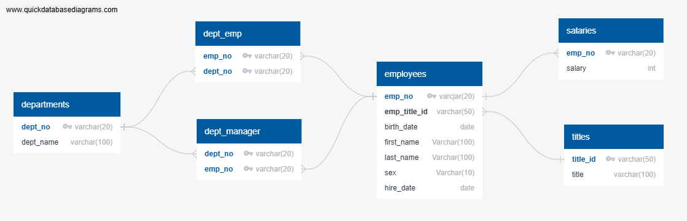

# SQL Challenge

## Project Overview
This project involves designing and implementing a relational database to analyze employee data. The challenge is divided into three main parts:

1. **Data Modeling**: Creating an Entity Relationship Diagram (ERD) based on provided CSV files.
2. **Data Engineering**: Defining table schemas, setting primary and foreign keys, and importing data into a PostgreSQL database.
3. **Data Analysis**: Writing SQL queries to extract insights from the database.

---

## Repository Structure
```
sql-challenge/
│   ├── data/                      # Folder containing CSV files
│   ├── schema.sql                  # SQL script for table creation
│   ├── analysis_queries.sql        # SQL script for required analysis queries
│   ├── ERD.png                     # Entity Relationship Diagram using QuickDBD
│   ├── postgres_ERD.png            # Entity Relationship Diagram from postgres
│   ├── README.md                   # Project documentation
```

---

## Data Modeling
### Entity Relationship Diagram (ERD)
- Designed an ERD based on the given CSV files.
- Used QuickDBD to visualize table relationships.
- Defined primary keys, foreign keys, and constraints.
- 
---

## Data Engineering
### Table Schema
Created six tables based on the CSV files:
- **employees**
- **departments**
- **dept_emp** 
- **dept_manager** 
- **salaries**
- **titles**

### Database Setup
1. Defined table schemas in `schema.sql` with appropriate data types and constraints.
2. Set primary keys and foreign keys for relationships.
3. Imported CSV data 

---

## Data Analysis
Performed the following SQL queries in `analysis_queries.sql`:
1. List employee details with salaries.
2. List employees hired in 1986.
3. List department managers along with department details.
4. List employee department details.
5. Find employees with first name 'Hercules' and last name starting with 'B'.
6. List employees in the Sales department.
7. List employees in the Sales and Development departments.
8. Count and rank last names by frequency.

---

## Usage
### Prerequisites
- PostgreSQL installed
- pgAdmin or any SQL editor

### Steps to Run
1. Clone this repository:
   ```bash
   git clone https://github.com/dagimg16/sql-challenge.git
   ```
2. Navigate to the project folder:
   ```bash
   cd sql-challenge
   ```
3. Open `schema.sql` in PostgreSQL and execute to create tables.
4. Import CSV data .
5. Run `analysis_queries.sql` to execute queries.

---

## Tools Used
- PostgreSQL
- QuickDBD
- Git/GitHub
- SQL

---

## Acknowledgments
- Thanks to SMU and my instructors for guiding me through this learning journey!
- And a big thank you to everyone checking out this project.

---

## License
This project is for educational purposes and follows an open-source license.


